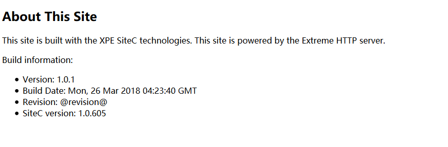

## 快速入门

#### 哪里可以体验到 XPE ?
+ [这里](http://www.celer.cc/)戳一下吧

#### 怎么开始？ 
+ 注册一个账号
+ 登录
+ 新建一个项目
+ 编译
+ 预览

> 

当你看到上面内容时，恭喜你， 你完成了第一个项目

#### 怎么出来的？

先看下目录结构
```
   src
    ├─sitemap.xml
    ├─content
    │  └─aboutSite.xml
    ├─css
    ├─fonts
    ├─images
    ├─js
    ├─ms
    ├─resources
    └─templates
       └─single.xml
```
### 解释下:

[请参考](http://www.celer.cc/documentation/sitemapref)

